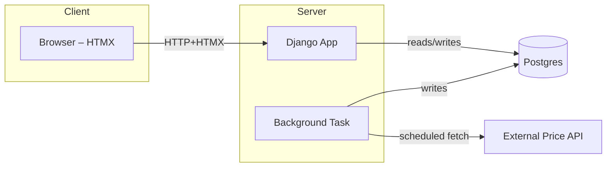

# Stock‑Market Simulator: Project Scope

*Last updated: 8 June 2025*

---

## 1: Purpose

A publicly‑demoable, play‑money simulator where users trade real‑time quotes for a curated set of US & UK equities (plus stretch‑goal FX).

---

## 2: Feature Roadmap

| Feature             | Detail                                                 | Definition of Done                                              |
| ------------------- | ------------------------------------------------------ | --------------------------------------------------------------- |
| Authentication      | Register / Login / Password reset via email token      | Can create account & receive JWT; password reset link functions |
| Cash Wallet         | £100 000 seed balance stored on `Profile`              | Balance persists & updates after trades                         |
| Market‑Only Orders  | Buy/Sell endpoint; server assigns current market price | Order recorded, wallet debited/credited                         |
| Live Price Feed     | 15 s cron task pulls quotes for up to 120 symbols      | `Price` table updates; prices visible in UI                     |
| Portfolio View      | Holdings list + unrealised P/L                         | Page/API returns aggregated positions                           |
| Transaction History | Paginated table of past orders                         | Responsive endpoint/UI + tests                                  |
| Basic Analytics     | Daily % P/L, Sharpe or VaR                             | Metric computed & displayed                                     |
| Leaderboard         | Top accounts by P/L                                    | Cached query updates every hour                                 |
| Web‑Socket Prices   | HTMX swap or Django‑Channels stream                    | Live updating price badge per symbol                            |

---

## 3: Trading Universe

* **Equities**: Top 100 S\&P constituents + Top 20 FTSE 100
* **FX (stretch)**: EURUSD, GBPUSD, USDJPY
* **Data Providers (free tier)**: Alpha Vantage, Twelve Data, Finnhub

---

## 4: Architecture (MVP)

*Container plan*: single `api` container + `postgres` container. React front‑end optional.

---

## 5 · Environment Variables

| Name                        | Purpose                   | Source (dev)      | Source (CI)    | Source (prod)       |
| --------------------------- | ------------------------- | ----------------- | -------------- | ------------------- |
| `POSTGRES_USER/PASSWORD/DB` | DB access                 | `.env`            | GitHub Secrets | AWS Secrets Manager |
| `SECRET_KEY`                | Django secret             | `.env`            | GitHub Secrets | Secrets Manager     |
| `PRICE_API_KEY`             | Quote API auth            | `.env` (dummy)    | GitHub Secrets | Secrets Manager     |
| `ALLOWED_SYMBOLS`           | Comma list for validation | committed default | same           | same                |

---

## 6 · CI/CD & DevOps Spine

1. **GitHub Actions**: lint → tests → build Docker → push to Amazon ECR → `terraform plan` (PR) → `terraform apply` (main ➜ staging) → manual prod promote.
2. **Terraform**: VPC, RDS Postgres, ECS Fargate Service; S3‑backed remote state (KMS encrypted).
3. **Observability**: CloudWatch logs & alarms (CPU, memory, 5xx); Grafana Cloud optional.
4. **Security**: Non‑root images, IAM least privilege, SG inbound 443 only.

---

## 7 · Public Demo Strategy

* **Primary**: Free‑tier AWS Fargate (t3.micro) behind CloudFront with ACM cert.
* **Fallback**: Loom video walk‑through + staging URL in README.

---

## 8 · Milestone Timeline (T0 = 7 June 2025)

| Day  | Deliverable                                              |
| ---- | -------------------------------------------------------- |
| T0   | Repo init, virtualenv, Django skeleton committed         |
| T+1  | Dev Dockerfile & docker‑compose with Postgres running    |
| T+2  | GitHub Actions (lint + tests + build) green badge        |
| T+3  | Auth + wallet models & first migrations                  |
| T+7  | Price fetcher hitting Alpha Vantage; Buy/Sell endpoint   |
| T+10 | CI pushing images to ECR; Terraform VPC/RDS/ECS plan     |
| T+14 | Public demo live; Loom recorded; README updated          |
| T+21 | P1 features (history, analytics); CloudWatch alarms      |
| T+28 | Stretch goals (leaderboard, web‑socket), polish & freeze |

